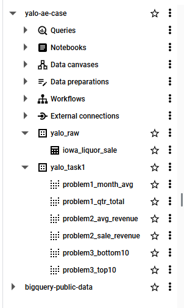
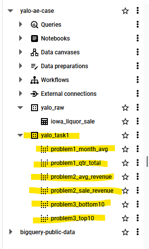
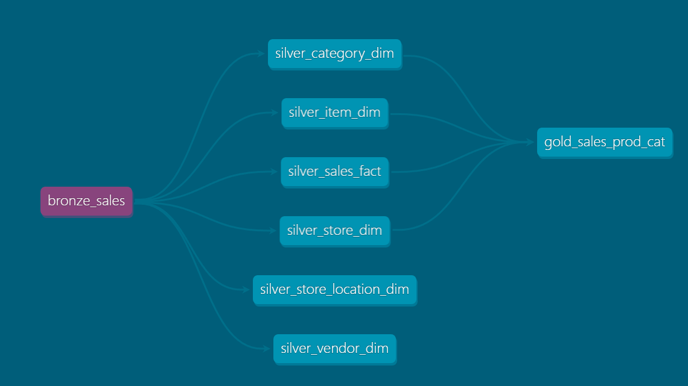
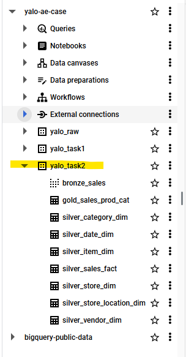
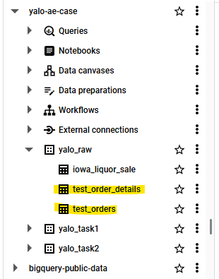

# Yalo Challenge - Analytics Engineering

1. To solve task #1 and #2, please use the following dataset: [Dataset Iowa Liquor](https://console.cloud.google.com/marketplace/details/iowa-department-of-commerce/iowa-liquor-sales?filter=solution-type:dataset&filter=category:analytics&id=18f0a495-8e20-4124-a349-0c4c167b60ab&project=my-project-cc-20220626)
2. Feel free to choose the presentation form of your preference:
    - For example, you can choose a PDF form to present answers and designs.
    - It is important that the code can be linked to a repo (private or public but shared) and that it should be easy to understand.

#### Task 1
*(Note - This task aims to test your SQL skills)*

1. Calculate the total products and revenue sold over time by quarter and identify the month where the revenue sold was 10% above the average.
2. List the counties where the amount (in dollars) of purchases transactions went over $100K.
3. Identify the top 10 stores with more revenue in sold products and the bottom stores with least revenue in sold products (apply a deduplication logic in case it’s needed).

#### Task 2
*(Note - This task aims to test your data modeling skills. Feel free to use any data modeling techniques, as we use dbt for our data modeling)*

Imagine the provided dataset as a source table in a production database. Please provide a data lineage of the data pipeline and design appropriate data layers for this case. Briefly describe what is the underlying logic of every layer and why you chose it.

You should include :
1. Ingestion/source table(s)
2. Transformation table(s) - you can have multiple layers/tables as required
3. Analytics table(s) (the final table/s which are going to be used from the end users and
in the BI tool)
    - Please present the structure of your final table(s) with all the columns/fields
you would like to include, along with their format.
    - Example: | col_name1 | col_name2 | col_name3| etc.

#### Task 3

Tables:
table: test_orders

<table>
    <thead>
        <tr>
            <th>customer_id</th>
            <th>purchase_date</th>
            <th>purchase_revenue </th>
        </tr>
    </thead>
    <tbody>
        <tr>
            <td>1</td>
            <td>2015-01-01 14:32:51</td>
            <td>25.34 </td>
        </tr>
        <tr>
            <td>2</td>
            <td>2015-01-02 12:14:51</td>
            <td>34.34 </td>
        </tr>
        <tr>
            <td>3</td>
            <td>2015-01-02 18:08:21</td>
            <td>37.15 </td>
        </tr>
        <tr>
            <td>2</td>
            <td>2015-03-02 23:42:21</td>
            <td>47.24 </td>
        </tr>
        <tr>
            <td>2</td>
            <td>2015-04-02 23:42:21</td>
            <td>54.12 </td>
        </tr>
        <tr>
            <td>3</td>
            <td>2015-07-03 22:07:11</td>
            <td>65.21 </td>
        </tr>
        <tr>
            <td>1</td>
            <td>2015-09-03 21:02:41</td>
            <td>74.60 </td>
        </tr>
        <tr>
            <td>3</td>
            <td>2015-10-03 05:15:24</td>
            <td>11.30 </td>
        </tr>
        <tr>
            <td>2</td>
            <td>2015-10-03 07:11:56</td>
            <td>22.45</td>
        </tr>
    </tbody>
</table>

table: test_order_details

<table>
    <thead>
        <tr>
            <th>customer_id</th>
            <th>order_id</th>
            <th>purchase_timestamp</th>
            <th>number_items</th>
            <th>purchase_price</th>
            <th>item_status </th>
        </tr>
    </thead>
    <tbody>
        <tr>
            <td>1</td>
            <td>1</td>
            <td>20150101 14:32:51</td>
            <td>2</td>
            <td>4.35</td>
            <td>returned </td>
        </tr>
        <tr>
            <td>1</td>
            <td>1</td>
            <td>20150101 14:32:51</td>
            <td>3</td>
            <td>8.446666667</td>
            <td>sold </td>
        </tr>
        <tr>
            <td>2</td>
            <td>1</td>
            <td>20150102 12:14:51</td>
            <td>1</td>
            <td>24</td>
            <td>sold </td>
        </tr>
        <tr>
            <td>2</td>
            <td>1</td>
            <td>20150102 12:14:51</td>
            <td>2</td>
            <td>5.17</td>
            <td>sold </td>
        </tr>
        <tr>
            <td>3</td>
            <td>1</td>
            <td>20150102 18:08:21</td>
            <td>3</td>
            <td>10</td>
            <td>sold </td>
        </tr>
        <tr>
            <td>3</td>
            <td>1</td>
            <td>20150102 18:08:21</td>
            <td>1</td>
            <td>7.15</td>
            <td>sold </td>
        </tr>
        <tr>
            <td>2</td>
            <td>2</td>
            <td>20150302 23:42:21</td>
            <td>2</td>
            <td>20</td>
            <td>sold </td>
        </tr>
        <tr>
            <td>2</td>
            <td>2</td>
            <td>20150302 23:42:21</td>
            <td>1</td>
            <td>7.24</td>
            <td>returned </td>
        </tr>
        <tr>
            <td>2</td>
            <td>2</td>
            <td>20150302 23:42:21</td>
            <td>1</td>
            <td>7.24</td>
            <td>sold </td>
        </tr>
        <tr>
            <td>2</td>
            <td>3</td>
            <td>20150402 23:42:21</td>
            <td>3</td>
            <td>18.04</td>
            <td>sold </td>
        </tr>
        <tr>
            <td>3</td>
            <td>2</td>
            <td>20150703 22:07:11</td>
            <td>2</td>
            <td>20</td>
            <td>sold </td>
        </tr>
        <tr>
            <td>3</td>
            <td>2</td>
            <td>20150703 22:07:11</td>
            <td>1</td>
            <td>25.21</td>
            <td>sold </td>
        </tr>
        <tr>
            <td>3</td>
            <td>2</td>
            <td>20150703 22:07:11</td>
            <td>4</td>
            <td>17.21</td>
            <td>returned </td>
        </tr>
        <tr>
            <td>1</td>
            <td>2</td>
            <td>20150903 21:02:41</td>
            <td>3</td>
            <td>10.2</td>
            <td>sold </td>
        </tr>
        <tr>
            <td>1</td>
            <td>2</td>
            <td>20150903 21:02:41</td>
            <td>2</td>
            <td>22</td>
            <td>sold </td>
        </tr>
        <tr>
            <td>1</td>
            <td>2</td>
            <td>20150903 21:02:41</td>
            <td>1</td>
            <td>15</td>
            <td>returned </td>
        </tr>
        <tr>
            <td>3</td>
            <td>3</td>
            <td>20151003 05:15:24</td>
            <td>1</td>
            <td>11.3</td>
            <td>sold </td>
        </tr>
        <tr>
            <td>2</td>
            <td>4</td>
            <td>20151003 07:11:56</td>
            <td>1</td>
            <td>22.45</td>
            <td>sold</td>
        </tr>
    </tbody>
</table>

Questions:
1. Table `test_orders` stores the purchase_revenue based on the individual items in table `test_order_details`. This means that `purchase_price` times `number_items` for all sold items should equal `test_orders.purchase_revenue`. Write a query to verify each individual purchase, making sure that the condition `purchase_revenue = number_items * purchase` for sold items holds true. If this verification fails, output the difference between the (`purchase_items * number_items`) and `purchase_revenue`.
2. With table `test_order_details` write a query that calculates per customer how much additional money could have been made if the customer had not returned items, the original amount the customer spent, the amount that would have made if no items were returned and the percentage increase between the original revenue and the revenue if no items would have been returned.
3. Based on question 2, which customer would you pay the most / least attention to reduce the number of returned items and why?
4. Based on question 1, how could you improve table `test_orders` to simplify the JOIN between `test_orders` and `test_order_details`?

#### Task 4
*LookML assessment (ideally linked in the same repo)*

Taking the Iowa Liquor Sales dataset provided you are told that a client wants a report that shows sales by product and category, including the following data:
  - Category Name
  - Total sales (price * quantity)
  - Average sales per customer

Use a products defined table and an orders table with the following basic structures:
products:
  - itemno
  - im_desc

orders:
  - invoice_line_no
  - itemno
  - sale_bottles
  - sale_dollars
1. Configure LookML views for both tables.
2. Create an Explore that enables the requested analysis
3. Ensure that the orders view is properly configured to handle duplicate

## SOLUTION

To solve this case I've created a containerized solution using `dbt` and `BigQuery` (also a separated `postgreSQL` instance for data extraction, if needed). The `iowa_liquor_sales` table provided was stored in `BigQuery`'s public database, so to access it I've created a project in `GCP` (`Yalo-AE-case`) and a `service account` (that generated the `json` file I've used in the `key` folder to connect to the project - I can send it per request). With the cloud elements configured, I've copied the table from the `public-data` database to `yalo-as-case`, under the `yalo_raw` schema, as can be seen bellow: 

### *Setup*
Before diving deeper into this case's tasks, it is important to explain how to access all the necessary elements. Please follow the steps bellow:

1. in CMD, docker compose up -d
2. VsCode `Open a Remote Window` to PyContainer to access dbt project
3. dbt is already configured to connect to `BigQuery`'s project, via the service account `yalo-dbt-user@yalo-ae-case.iam.gserviceaccount.com`
4. `Dockerfile` and `docker-compose.yml` as already configured to access `BigQuery` and `postgreSQL`, if needed
5. after containers initialization, to access `postgreSQL`, `localhost:5050` can be opened (for `PGAdmin` access)
  - email = 'erosa@email.com'
  - password = 'password'
  - right click Server, Register, Server
  - General - name: `YALO`
  - Connection - HOST: `host.docker.internal`
  - Connection - password: `password`
  - SAVE
6. to extract data from BQ to PG, run the `bq_to_posgresql.py` script
  - unfortunately, the data extraction takes too long to be properly used for this case's presentation
  - **if access to BQ project is needed to run the dbt models, please let me know and I will add all necessary accounts as viewers in this project**

*please note that I've created all necessary elements for this project to run in BQ or PG, based on profile outputs, but I haven't tested all executions in postgreSQL, errors might occur* 

Following, explanations about the elements of this project:

#### 1. Docker 

- Dockerfile has all the necessary configurations and variables for running this project, in BQ or postgreSQL. 
- `docker-compose.yml` creates all PG necessary containers and also a running `Python` container, to be used as a virtual environment for this `dbt` project

#### 2. dbt

- `dbt` has been configured to connect to `yalo_raw.iowa_liquor_sales` table in BQ
- in `profiles.yml` I've configured many different outputs, so each task solution is generated in a new dataset
    - to facilitate the execution of the codes, I've created environmental variables, such as  `ENV TASK3="--models task3.* --target task3"` that can be called in CMD: `dbt run $TASK3`. This command will automatically create a new dataset and generate all necessary tables
- for this exercise, no snapshots, personalized tests or macros were created, but they could easily be added to the project if needed

#### 3. BigQuery

- BQ is the main database for this case and, as stated before, is completely configured to generate the tables from `dbt` models

#### 3. postgreSQL

- PG has been added as a form of test. My goal was to extract the data from BQ to exclude the necessity for a GCP account to be added, but the extraction time became too long and it is not being used in this solution (but is available if needed)
- a `raw/sample-db.sql` has been created and copied to `docker-entrypoint-initdb.d` at container init to create the schemas and table necessary for data extraction from BQ to postgreSQL

### Tasks

In here I will provide explanations for the problems and solutions that I've created

TASK #1

- I've created the solutions for the problems in this task as models in `dbt`
- all models have been created using the `raw` table as SOURCE
  - answers (as views) can be generated if command `dbt run $TASK1` is executed, generating the following result:

- the answers for the TASK #1 have been all created in the `yalo_task1` dataset
  - since I've found some of questions dubious, I've decided to create more than one answer for them:
    - question 1: this is divided in two parts, so I've generated 2 tables. The second table (`problem1_month_avg`) thou has more than one column that potentially solves the question, but I didn't know if the average was based on quarters or on the entire table, so I've presented both answers
    - question 2: I didn't know if the question was over some period of time or about individual sales, so I created two tables, one for each of these cases
    - question 3: I've also created 2 separated tables, showing top and bottom 10 stores in revenue - no deduplication logic was needed

TASK #2

- to solve this question, I've used a medallion architecture concept, where I've (throughly) cleaned most of the data to create a bronze layer, the divided the table into fact and dimensions in silver layer and finally created one gold table (simulating a data mart) that used TASK #4 as inspiration.
  - bronze: 
    - to generate the bronze version of the table, I've applied many layers of data cleaning techniques. Most, if not all columns had issues with them, so I've decided to focus on `county`, `city` and `category` (creating a more broad spectrum `flag_category` to facilitate analisys). The other fields were cleaned mainly by populating `NULL` values with proper elements
  - silver:
    - silver tables have been created based on FACT and DIMENSION modelling (STAR schema). Important elements of the invoices were kept in the main table, while other information has been put in separated tables. 
    - I've also used a dbt package to help me create a comprehensive `date` dimension (as can be seen in `silver_date_dim.sql`)
  - gold: 
    - gold table is an aggregate view of certain elements that together provide specific information, or a mean to calculate what has been requested. In the case of this exercise, I've created a table that can be used to calculate what has been asked in TASK #4
  - all tables have their own schemas in `schema.yml`, with certain tests for the primary/natural keys. Some tests are failing as of now, since they are from columns and tables we will not be using in our gold layer and their treatment would take way too long to be executed (notably, `silver_store_dim` and `silver_vendor_dim`).
  - `dbt_project.yml` has the overall configuration for how these tables are being generated - bronze is a `view`, silver and gold are `tables`, per best practices.
  - lineage of the tables can be created using `dbt`'s doc functionallity. Using the commands `dbt docs generate` and `dbt docs serve` we can automatically create the tables lineage as bellow:

  - as seen before, all these tables are under the `yalo_task2` dataset, but they could have been created in other datasets or in different databases. I've chosen to put them all together to maintain a project created based on the tasks proposed

TASK #3

- `seeds`: tables provided in the text of the task have been uploaded as csv to the folder `seeds` and exported to BQ using the command `dbt seed $RAW`. Both of them have been added to the `yalo_raw` dataset:

- answers for both problems 1 and 2 of the task are created with the command `dbt run $TASK3`
- question 3: I would pay most attention to customer 1, due to the fact that he returned the most amount of items (even thou they were not very expensive). The number of items returned by him, compared to the number of purchases is really high, which shows that probably he is not satisfied with many things the company offers. Number 3 had 1 big return, but it could be an outlier to the "returns table", with so little data is hard to know. He also buys expensive items. I would pay less attention to customer number 2, since he returned 1 item and it was not expensive at all.
- question 4: none of these two tables have explicit primary keys, but in regard of the join from `test_orders` to `test_order_details`, I would say that creating a primary key for `test orders` would be the first thing to do. What I've done to solve the problem was parsing the date column as an int and using both customer and date_int as a primary key, for both. Also adding the aggregated returned values would be good to the table.

TASK #4

- even thou I've created environmental variables for this task, I've ended answering it in a separate folder in the project root, called `lookML`
- unfortunately I don't have access to Looker, so I had to create the views and explore without any tests, there might be errors there
- based on the modelling proposed on TASK #2 and the request on the problem text, I've created on view for each silver table used in the gold aggregation and an explore to represent this aggregation. Each view has their own dimensions and measures. To calculate `average sales per customer` as requested it is only necessary to open the `average_correct_sale` from the `sales_fact` view and select `store_name` (or `store_number`) from `store_dim` view.

To finalize I would like to thank you for the opportunity to solve this case and to put myself available for any questions, doubts or inquiries about this project, or any other topic! 

*Please remember to ask me to send the access key and to add the necessary emails, if opening the BQ project becomes a necessity.* 

Thanks,
Emmanuel Rosa
  
